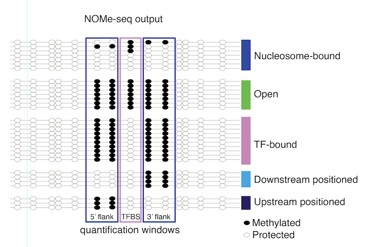

```{r, include = FALSE}
knitr::opts_chunk$set(
    collapse = TRUE,
    comment = "#>"
)
```

## Introduction

The objective of `dinoR` is to detect potential differences in nucleosome 
binding/accessibility patterns between two groups of NOMe-seq experiments. 
We recently developed a method, called guided NOMe-seq, which allows for 
obtaining high coverage NOMe-seq data from more than 1000 regions of interest 
(ROIs) in the genome at low cost, thereby allowing us to profile multiple 
samples at once (manuscript submitted). For example, as shown below, we 
generated NOMe-seq data from ROIs spanning CTCF motifs from wild-type (WT) 
and ADNP knock-out mouse ES cells, in duplicates. To facilitate processing
of these samples, with a focus on detecting differences in nucleosome 
positioning between WT and ADNP KO cells, we developed `dinoR`. `dinoR` 
focuses on comparing ROIs which are grouped together based on similar features 
(for example, which transcription factor binds the motif in the ROI), and 
statistical analysis of NOMe-seq pattern differences between samples. For 
quality control and plotting methylation across a single ROI, please refer 
to the Bioconductor package `SingleMoleculeFootprinting`.

## Installation

dinoR is available on Bioconductor and can be installed via:

```{r install-pkg, eval = FALSE}
if (!require("BiocManager", quietly = TRUE)) {
    install.packages("BiocManager")
}
BiocManager::install("dinoR")
```

then we can load dinoR and other necessary packages:

```{r setup}
suppressPackageStartupMessages({
    library(dinoR)
    library(ggplot2)
    library(dplyr)
})
```

## Load the NOMe-seq data for Adnp Knock-Out and 
## WT mouse ES cells (two replicates each)

To obtain the example data shown below, we used
[biscuit](https://huishenlab.github.io/biscuit/) to map 300bp 
paired-end reads to the genome, 
[UMI-tools](https://github.com/CGATOxford/UMI-tools) to remove 
duplicated UMIs, and the 
[fetch-NOMe package](https://github.com/fmi-basel/gpeters-fetchNOMe) 
to get the protection from GCH methylation calls for each read pair (fragment)
overlapping a region of interest (ROI). 
We then use the R package
[NOMeConverteR](https://github.com/fmi-basel/gbuehler-NOMeConverteR) 
to convert the resulting tibble into the RangedSummarizedExperiment object
that is loaded below. 
This represents an efficient way of sharing NOMe-seq data. 

Alternatively, mapping and obtaining
the GCH methylation calls can be done using
[QuasR](https://bioconductor.org/packages/QuasR/), 
or any other bisulfite aware mapping/quantification tool.
The results then need to be
converted into a RangedSummarizedExperiment. For an example 
NOMe-seq RangedSummarizedExperiment see
the example data loaded below,
or the data generated by using `dinoR::createExampleData`.

Importantly, the ROIs should all be the same length and centered
around a transcription factor motif,
with the strand of the motif indicated. That will ensure
that the genomic positions around the motif 
are sorted according to motif strand, which will allow the user to observe 
potential asymmetries in protection from methylation relative to the TF motif. 


```{r load data}
data(NomeData)
NomeData
```

The reads assay contains GPos objects with the GCH methylation 
data in two sparse logical matrices, one for protection from 
methylation, and one for methylation.

```{r reads}
assays(NomeData)[["reads"]][1, 1]
```

## Meta plots across ROIs with common TF motifs in the center

We generate metaplots, grouping our ROIs into those that have  Rest,
Ctcf, or Adnp bound to the motifs in their center.
We use 2 samples from WT mouse ES cells, and two samples from Adnp KO 
mouse ES cells. We exclude any ROI - sample combinations which contain 
less than 10 reads (nr=10).

```{r,fig.height=6,fig.width=8}
avePlotData <- metaPlots(NomeData = NomeData, nr = 10, ROIgroup = "motif")

# plot average plots
ggplot(avePlotData, aes(x = position, y = protection)) +
    geom_point(alpha = 0.5) +
    geom_line(aes(x = position, y = loess), col = "darkblue", lwd = 2) +
    theme_classic() +
    facet_grid(rows = vars(type), cols = vars(sample), scales = "free") +
    ylim(c(0, 100)) +
    geom_hline(
        yintercept = c(10, 20, 30, 40, 50, 60, 70, 80, 90),
        alpha = 0.5, color = "grey", linetype = "dashed"
    )
```

We can already see that while the NOMe footprints around Rest and Ctcf 
bound motifs don't change, there are clear differences between WT and 
Adnp KO cells around the Adnp bound motifs.

## Determine fragment counts for five chromatin patterns: 
## TF, open, upNuc, downNuc, Nuc 

To quantify the differences visible in above meta plots, we adopted 
and slightly modified the approch of Sönmezer et al., 2021. We classify 
each fragment according to five types of footprints: transcription 
factor bound (TF), open chromatin, and nucleosome (we distinguish also 
upstream positioned nucleosome (upNuc), downstream positioned nucleosome 
(downNuc), and all other nucleosome (Nuc) footprints). To do this we use 
three windows (-50:-25, -8:8, 25:50) around the motif center (which should 
correspond to the ROI center of the provided ROIs). 



```{r fragment classification}
NomeData <- footprintCalc(NomeData)
NomeData
```

This results in the addition of an assay called footprints, 
which assigns each fragment one of the five footprint classes described above.

```{r fragment classification example}
assays(NomeData)[["footprints"]][[1, 1]][1:10]
```

Then we count the number of fragments in each sample-ROI combination 
supporting each footprint class. 

```{r fragment class counts}
NomeData <- footprintQuant(NomeData)
NomeData
```

Note that if a fragment does not have methylation protection data in
all three windows needed for classification, the fragment will not be used. 

Next we can test for differential abundance of footprints between 
Adnp KO and WT samples.

## Calculate differential NOMe-seq footprint abundance between Adnp KO and WT 

We use edgeR to check for differences in abundance between wild type and 
Adnp KO samples for each footprint type fragment count compared to the 
total fragment counts. Library sizes for TMM normalization are calculated 
on the total fragment counts. 

```{r diNOMe}
res <- diNOMeTest(NomeData,
    WTsamples = c("WT_1", "WT_2"),
    KOsamples = c("AdnpKO_1", "AdnpKO_2")
)
res
```

We can then simply plot the number of regulated ROIs 
within each ROI type...

```{r nregulated, fig.height=4,fig.width=7}
res %>%
    group_by(contrasts, motif, regulated) %>%
    summarize(n = n()) %>%
    ggplot(aes(x = motif, y = n, fill = regulated)) +
    geom_bar(stat = "identity") +
    facet_grid(~contrasts) +
    theme_bw() +
    theme(axis.text.x = element_text(angle = 90, vjust = 0.5, hjust = 1)) +
    scale_fill_manual(values = c("orange", "grey", "blue3"))
```


...or display the results in MA plots.

```{r MAplot,fig.height=2,fig.width=10}
ggplot(res, aes(y = logFC, x = logCPM, col = regulated)) +
    geom_point() +
    facet_grid(~contrasts) +
    theme_bw() +
    scale_color_manual(values = c("orange", "grey", "blue3"))
```

## Calculate the percentage of fragments in each footprint type and 
## plot a (clustered) heatmap comparing percentages in WT and Adnp KO

```{r percentages,fig.height=5,fig.width=7}
footprint_percentages <- footprintPerc(NomeData)
fpPercHeatmap(footprint_percentages)
```

## Compare the footprint percentages and significance testing
## results for Adnp KO and WT 

```{r comparison,fig.height=4,fig.width=8}
compareFootprints(footprint_percentages, res,
    WTsamples = c("WT_1", "WT_2"),
    KOsamples = c("AdnpKO_1", "AdnpKO_2"), plotcols = 
        c("#f03b20", "#a8ddb5", "#bdbdbd")
)
```

We can see that in Adnp KO samples, transcription factor 
footprints significantly increase around Adnp motifs, 
while nucleosome footprints decrease. 

## Combining the nucleosome patterns

In case we are not interested in the upstream and downstream nucleosome 
patterns, but would rather keep all nucleosome pattern fragments within
the nucleosome group, we can do that using the option combineNucCounts=TRUE. 

```{r,fig.height=2,fig.width=8}
res <- diNOMeTest(NomeData,
    WTsamples = c("WT_1", "WT_2"),
    KOsamples = c("AdnpKO_1", "AdnpKO_2"), combineNucCounts = TRUE
)
footprint_percentages <- footprintPerc(NomeData, combineNucCounts = TRUE)
compareFootprints(footprint_percentages, res,
    WTsamples = c("WT_1", "WT_2"),
    KOsamples = c("AdnpKO_1", "AdnpKO_2"), plotcols = 
        c("#f03b20", "#a8ddb5", "#bdbdbd")
)
```

## Session information

```{r}
sessionInfo()
```

